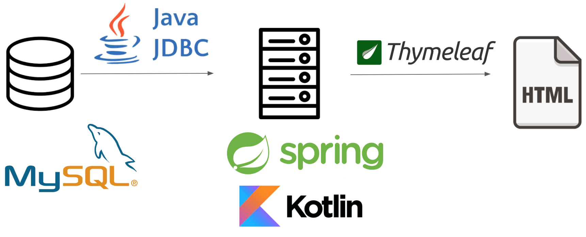

# 2018 CS360 Term Project

Term project for 2018 CS360 Introduction to Database.  

___

## Team members

전철호([@cjeon](https://github.com/cjeon)), 배성범([@bsb0579](https://github.com/bsb0579))

## Project Objective

Build a micro web board that utilizes DB operations including 
* Basic CRUD operation
* Join operation
* Subquery operation
* views and triggers

## Tables 

1. Users
2. Posts
3. Comments
4. Bookmarks
5. Reports 

## User Story

User can CRUD post. User with admin privilege can modify other user's post.

User can CR comment. User can create report. User can CRD bookmark.

## ER diagram

(insert screenshot here)

## Service Stack

